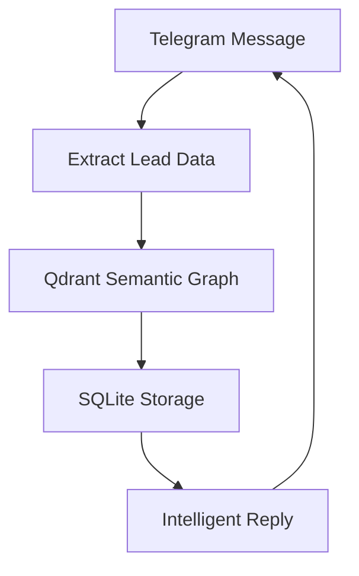

## Overview

BizNode runs as a portable AI agent that handles business operations autonomously. You launch it from USB, VPS, or local machine, configure Telegram and email, and let it manage leads, replies, and interactions. This guide covers launching the agent, initial setup, email sending, lead management, and monitoring.

<Callout kind="info">
  Ensure you have Ollama installed with Qwen2.5 model, Qdrant running, and Docker for dependencies before starting.
</Callout>

## Launching BizNode

Follow these steps to get your agent running.

<Steps>
  <Step title="Download and Extract" icon="download">
    Download the latest BizNode release from [biznode.1bz.biz/download](https://biznode.1bz.biz/download).

    Extract to a directory:

````bash
tar -xzf biznode-v1.0.0.tar.gz
cd biznode-v1.0.0
````

  </Step>
  <Step title="Start Dependencies" icon="settings">
    Launch required services:

````bash
docker run -d -p 11434:11434 --name ollama ollama/ollama
ollama pull qwen2.5:7b
docker run -d -p 6333:6333 qdrant/qdrant
````

  </Step>
  <Step title="Run BizNode" icon="play">
    Start the agent:

````bash
./biznode start --config config.yaml
````

    The agent binds to `localhost:8080` and Telegram bot.
  </Step>
</Steps>

## Telegram Bot Setup

Create a Telegram bot for your agent's identity.

<Tabs>
  <Tab title="BotFather Setup" icon="bot">
    1. Message [@BotFather](https://t.me/botfather) on Telegram.
    2. Send `/newbot` and follow prompts.
    3. Note the bot token: `123456:ABC-DEF1234ghIkl-zyx57W2v1u123ew11`.

    Add to `config.yaml`:

````yaml
telegram:
  bot_token: "123456:ABC-DEF1234ghIkl-zyx57W2v1u123ew11"
  chat_id: "YOUR_CHAT_ID"
````
  </Tab>
  <Tab title="Test Interaction" icon="message-circle">
    Send a message to your bot and verify replies.

````bash
curl -X POST "https://api.telegram.org/bot{YOUR_BOT_TOKEN}/sendMessage" \
  -d chat_id=YOUR_CHAT_ID \
  -d text="Test BizNode"
````

  </Tab>
</Tabs>

## Sending Autonomous Emails and Proposals

Configure email in `config.yaml` and trigger via API or Telegram.

<CodeGroup tabs="Configuration,Trigger">
  ```yaml
  email:
    smtp_host: "smtp.gmail.com"
    smtp_port: 587
    username: "agent@yourdomain.com"
    password: "YOUR_APP_PASSWORD"
    from_name: "BizNode Agent"
  ```
  ```bash
  curl -X POST http://localhost:8080/send-proposal \
    -H "Content-Type: application/json" \
    -d '{
      "to": "lead@example.com",
      "subject": "Business Proposal",
      "template": "proposal"
    }'
  ```
</CodeGroup>

<Callout kind="tip">
  Use app-specific passwords for Gmail. Test SMTP connectivity first.
</Callout>

## Managing Leads and Interactions

Leads auto-extract to SQLite + Qdrant memory.



View leads:

```
sqlite3 data/leads.db "SELECT * FROM leads;"
```

<Columns cols={2}>
  <Card title="Lead Commands" icon="users">
    - `/leads`: List recent
    - `/process <id>`: Handle specific lead
  </Card>
  <Card title="Network Sync" icon="share">
    Sync with 1BZ registry: `./biznode sync-registry`
  </Card>
</Columns>

## Monitoring Activity and Logs

Track agent performance.

<Expandable title="View Logs" default-open="true">
  Tail logs in real-time:

````bash
tail -f logs/biznode.log
````

  Look for entries like:

  ```
  [INFO] Lead extracted: name=John Doe, email=john@example.com
  [INFO] Proposal sent to john@example.com
  ```

</Expandable>

<Expandable title="Metrics Dashboard">
  Access at `http://localhost:8080/metrics`. Key metrics:

  | Metric          | Description                  |
  |-----------------|------------------------------|
  | leads_processed | Total leads handled          |
  | replies_sent    | AI-generated responses       |
  | memory_size     | Qdrant vector count          |
  | uptime          | Agent runtime                |

</Expandable>

For advanced troubleshooting, check Docker logs:

````bash
docker logs ollama
docker logs qdrant
````

<Callout kind="success">
  Your BizNode is now operational. Send a test lead via Telegram to verify end-to-end flow.
</Callout>